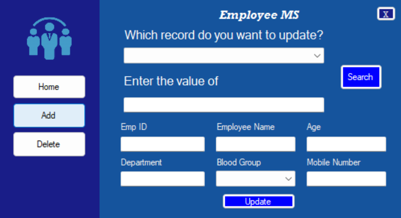

# Employee Management System
This is an Employee Management System created using Visual Studio, with SQLite as the database backend. It's designed to help organizations manage their employee information efficiently.

## Features

- **User-Friendly Interface**: An intuitive and user-friendly interface for easy navigation.
- **Employee Database**: Store and manage employee records.
- **Search and Filtering**: Quickly find employees by name or Employee ID.
- **Add and Update Employees**: Easily add new employees or update existing records.
- **SQLite Database**: Utilizes the lightweight and embedded SQLite database for data storage.

## Features to be implemented
- **Data Export**: Export employee data to various formats for reporting and analysis.

## Screenshots
The application has a total of five screens:
Firstly, the login page:  

  

Upon legitimate authentication you are presented with the home page:  

  

This is the page where you can add employee records:  

  

This is the page where you can delete a specific employee record:  

  

This is the page where you can update a specific employee record:  

  

## Getting Started

To run this Employee Management System on your computer, follow these steps:
Download the release folder. 
Run the "Employee Management System.exe" in the folder. 

## Acknowledgements

This project was done as a learning exercise.  
The icon used is taken from https://icon-icons.com/icon/business-man-employee-human-member-office-tie/107745. 

